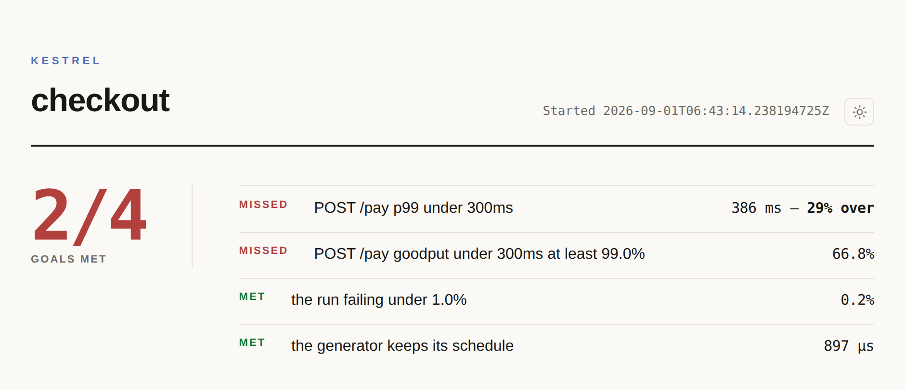
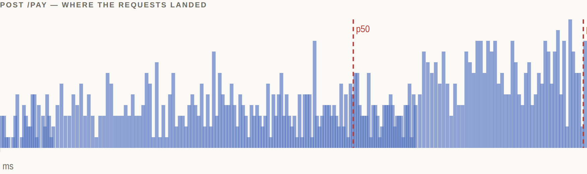

<div align="center">

<picture>
  <source media="(prefers-color-scheme: dark)" srcset="docs/assets/proofload-mark-dark.svg">
  
</picture>

# Proofload

### Load testing for Kotlin — with a p99 you can trust.

[](https://github.com/matthewjones372/proofload/actions/workflows/build.yml)
[](https://central.sonatype.com/artifact/io.github.matthewjones372/proofload-core)
<!-- Line coverage, which is what `koverVerify`'s floor is on. It is the kinder of
     two numbers — branch coverage over the same code is materially lower — and
     0116 carries that argument.
     The number is in the URL rather than fetched from a file, because a shields
     endpoint reads that file anonymously and raw.githubusercontent.com will not
     serve one from a private repository. `coverage-badge` rewrites this line. -->
[](https://github.com/matthewjones372/proofload/actions/workflows/build.yml)
[](LICENSE)
[](https://kotlinlang.org)
[](https://adoptium.net)

</div>

**A passing load test can still ship a slow service.** When the load generator
can't keep up, it quietly queues requests and reports the wait as your server's
latency — the classic *coordinated omission* bug — so the tail looks fine and the
test goes green anyway.

Proofload takes a different approach: it times every request from the moment it was
*meant* to start, and proves on every run whether the generator kept up. Green
means the numbers are the target's, not the tool's.

<div align="center">
<a href="docs/assets/report-full-light.png">
<picture>
  <source media="(prefers-color-scheme: dark)" srcset="docs/assets/report-verdict-dark.png">
  
</picture>
</a>

<sub>A real run. <code>POST /pay</code> missed its 300 ms target — and the green
<b>"the generator keeps its schedule"</b> is the proof that's the server's fault,
not the tool's. <a href="docs/assets/report-full-light.png">See the whole page →</a></sub>
</div>

## Write it in Kotlin, not in a framework

No base class to extend. No string keys to keep in sync. No XML, no separate DSL
language, no Docker. A scenario is a plain Kotlin value, and the result is
something your test reads straight off:

```kotlin
val orderId = sessionKey<String>("orderId")
val placeOrder = step("place order")
val api = http.baseUrl("https://orders.internal")

val checkout = scenario("checkout") {
    exec(step("browse"), api.get("/products"))
    exec(
        placeOrder,
        api.post("/orders")
            .body("""{"cart":"1 anvil"}""")
            .expecting(201)
            .capture(orderId) { it.header("location") },
    )
}

class CheckoutLoadTest {

    @LoadTest
    fun `checkout holds up at fifty a second`(proofload: Proofload) {
        val result = proofload.run(checkout.at(50.perSecond, over = 1.minutes))

        assertTrue(result[placeOrder].responseTime.p99 < 200.milliseconds)
        assertEquals(0L, result.failed)
    }
}
```

That is the whole test. `@LoadTest` hands you a `Proofload`, you assert on a value,
and it runs on virtual threads on the JDK's own HTTP client — nothing to install.
Everything is typed and named once: capture into `orderId` and it comes back a
`String`; rename `placeOrder` and the code stops compiling instead of silently
checking a step that no longer exists.

## Point it at anything

HTTP, server-sent events, WebSockets, gRPC, Kafka and JDBC come in the box, and
[Pelican](https://github.com/matthewjones372/pelican) typed endpoints are steps too.
Database steps time the connection checkout apart from the query, because a pool
your users queued for is not the database being slow.

Anything else — another queue, a cache — is just a step body. Whatever you call
inside it is timed and recorded like any other step, so you use the client you
already have:

```kotlin
exec(settle) {
    val outcome = ledger.settle(order)   // your own client, whatever it is
    if (!outcome.ok) fail(outcome.reason)
}
```

And for work that finishes somewhere else — publish now, match the reply that arrives
on another channel later — the latency you measure is the real round trip, not the ack.

## Or hand the whole thing to an agent

`proofload-mcp` is a stdio MCP server whose every tool is a call the CLI already
makes, so a model gets what a person at a terminal gets and there is no second
behaviour to keep in step.

It is on Maven Central, so adding it takes no clone and no build:

```bash
claude mcp add proofload -- jbang io.github.matthewjones372:proofload-mcp:0.1.0-rc3
```

The coordinate alone, because the published jar carries a `Main-Class`.
[Coursier](https://get-coursier.io) does the same job with `cs launch`. `java -jar`
is not one of the ways — the jar is thin and carries no classpath, so whatever starts
it has to resolve the POM.

Two more routes need no launcher at all — a download from the GitHub release, which
carries a `.bat` and so is the Windows answer too, and a container:

```bash
claude mcp add proofload -- docker run -i --rm -v "$PWD:/work:ro" ghcr.io/matthewjones372/proofload-mcp:0.1.0-rc3
```

That is the whole command: `benchmark`, `plan_schema`, `validate`, `preview`,
`smoke` and `trace` work with nothing else set up. Only `run` needs a fence — write
a `proofload.toml` in the directory you started it from and it is picked up, because
that directory is what the mount above hands over.

**Mount the directory, not the file.** `-v "$PWD/proofload.toml:..."` looks tidier
and creates a *directory* called `proofload.toml` in your working directory when the
file is not there yet, which then cannot be read as an allowance. Mounting the
directory has no such state to get wrong.

[docs/mcp.md](docs/mcp.md#starting-it) has all four routes.

While this repository is private, the release asset and the image are private with
it: the download needs `gh release download` and the image needs
`docker login ghcr.io`. Maven Central needs neither, so the `jbang` line above is the
one that works for anyone today.

Working on Proofload itself, or on an unreleased change, build it instead:

```bash
./gradlew :proofload-mcp:installDist
claude mcp add proofload -- "$PWD/proofload-mcp/build/install/proofload-mcp/bin/proofload-mcp"
```

A base URL is enough to start. `benchmark` writes a plan, validates it, previews
what it would send, and sends one request per step — then says what it had to
guess rather than pretending it knew:

```
> Does checkout hold up?  https://orders.internal

proofload:  plan/1
baseUrl:  https://orders.internal
scenario: smoke
steps:
  - name: root
    get: /
load:
  rate: 1/s
  over: 10s

Running this would send 10 requests over 10s peaking at 1.0/s to orders.internal.
One request per step, already sent: 1 requests, 1 ok, 0 failed

Nothing above sent load. Call `run` with this plan to do that.

This plan is guessing. Ask whoever wants the benchmark:
  - This only sends `GET /`, because a base URL is all it was given. Which paths
    actually matter — a journey, a hot endpoint, a slow one?
  - The rate is a placeholder — one a second, because nothing said otherwise.
    What does this see at peak, and over how long?
```

The questions come from that plan and that smoke: a credential is asked about
because the target answered 401, not because targets often need one. You answer,
it raises the rate on purpose and calls `run` — which returns rather than
blocking for ten minutes, so you poll it:

```json
{"runId":"r-3f9c1a04","sending":"3000 requests over 1m to orders.internal"}
{"state":"sending","remaining":"41s"}
```

When it lands, `status` is the same document the HTML report is drawn from —
every goal `met` or not, with the `remedy` beside the one that missed.

`status` answers a model. `summary` answers you, in the chat you are already
looking at: the markdown a GitHub job summary carries — the step table, the
behind verdict, failures and totals — and under it the shape the percentiles were
read off, which is the one thing the numbers cannot say on their own:

```
checkout  p50 10.0ms  p99 2.00s
 10ms  ############  900
100ms
   1s  #  100
```

Nine in ten answered in 10 ms and the rest took two seconds. A p99 of 2 s reads
like a step that is merely slow, and this is a cache missing a tenth of the time
— two different problems with the same percentile. Bars are the counted buckets
on the same log axis the page draws, the count printed beside each so the bar
never has to be trusted, and a decade that counted nothing is left blank rather
than smoothed.

**Hand it the contract, not just a base URL.** If the service has an OpenAPI
document, `from_openapi` reads it — YAML or JSON — and writes the plan it
describes, so the paths, methods and step names come from the contract rather
than a guess. `baseUrl` is only needed when the document names no server.

It also reads the *space* each parameter ranges over, because one id repeated is
a measurement of one row and one cache line, and cardinality and skew are what
move a p99. `minimum: 1, maximum: 500` becomes a uniform draw over exactly that
range, and `enum: [emea, apac, amer]` becomes every value it lists rather than
the first one — so the plan it writes arrives with its draws already in it:

```yaml
draw:
  sku:    {uniform: {from: 1, to: 500}}
  region: {oneOf: [emea, apac, amer]}
steps:
  - name: getProduct
    get: '/products/{sku}'
  - name: getRegion
    get: '/regions/{region}'
```

The braces survive so the draw has something to fill: `{sku}` in a path or a body
is filled per user from the session key of that name. A parameter the contract
does not bound is substituted rather than drawn — inventing a range the contract
never stated would be inventing a cardinality.

`draw` is not only for generated plans; write it in any plan yourself. `uniform`,
`zipf`, `oneOf`, `digits` and `uuids` are the generators, and `zipf` is the shape
real traffic has — a few keys asked for constantly and a long tail asked for once:

```yaml
draw:
  sku: {zipf: {keys: 1000000, skew: 1.1}}
```

**Only `run` sends load.** Everything else sends nothing, or one request per
step, and [the table](docs/mcp.md#the-tools) says which before you call it — so
a model still working out your plan cannot find that out at three thousand a
second. `proofload.toml` fences what it may do at all, by host, rate, duration
and request count.

**[docs/mcp.md](docs/mcp.md)** is the reference: every tool, what it sends, what
it refuses, and the `plan/1` format a model can ask for instead of guessing.

## What you get

- **A verdict you can believe.** Every run tells you whether the generator kept
  its own schedule. A green test on a generator that fell behind is the trap
  Proofload exists to close.
- **Real percentiles.** Bars are counted buckets, a percentile is the top of the
  bucket a sample landed in, on a log axis. No smoothing, no interpolation — if a
  number is on the page, something measured it.
- **A report, not a web app.** One self-contained HTML file: data, styles and
  charts inline. It opens straight from disk, uploads as a CI artifact as-is, and
  does light and dark. [See a full one.](docs/assets/report-full-light.png)
- **Answers before you run.** A scenario is a value, so
  `checkout.at(50.perSecond, over = 1.minutes).profile.userCount()` is `3000`
  before a single request goes out.

<div align="center">
<picture>
  <source media="(prefers-color-scheme: dark)" srcset="docs/assets/report-distribution-dark.png">
  
</picture>
</div>

## Get started

```kotlin
dependencies {
    testImplementation("io.github.matthewjones372:proofload-http:0.1.0-rc1")
    testImplementation("io.github.matthewjones372:proofload-junit5:0.1.0-rc1")
    testImplementation("io.github.matthewjones372:proofload-report-html:0.1.0-rc1")
}
```

Write the test above, then write the report:

```kotlin
result.writeHtmlReport(Path.of("build/reports/proofload/checkout.html"))
```

**[The cookbook](docs/cookbook.md) has the rest** — each recipe a few lines, with
a note on why it is those lines and not the obvious alternative:

| | |
|---|---|
| **[The vocabulary](docs/concepts.md)** | what a p99 is and why not an average; why lateness is a verdict; what Little's law catches |
| **Shaping load** | flat, ramped and staged profiles; Poisson arrivals; think time; a mix of journeys in one run |
| **Per-user data** | feeders as a function of the user number; CSV; a token refreshed off the measured path |
| **The requests** | captures, body checks, bodies filled per user or streamed from disk, cookies across redirects, W3C trace ids, WebSocket and SSE streams, gRPC, Kafka, work that finishes on another topic |
| **Asking the question** | goals and goodput; steady state; capacity search; comparing runs against a baseline |
| **Keeping the answer** | the HTML report, a GitHub job summary, and a baseline in CI |

> [!NOTE]
> Early days. `0.1.0-rc1` is the first release on Maven Central — a release
> candidate, so signatures and coordinates are real but the API may still move
> before `0.1.0`. `specs/` tracks what is built and what is not.

## The rest

- **[docs/what-it-costs.md](docs/what-it-costs.md)** — the tool's own measured overhead, so you can trust the numbers above it.
- **[docs/modules.md](docs/modules.md)** — the modules and the coordinates to depend on them.
- **[docs/mcp.md](docs/mcp.md)** — the MCP server in full: every tool, what each one sends, and what it refuses.
- **[docs/allowance.md](docs/allowance.md)** — `proofload.toml`, the fence a run is held to, and why it is a fence rather than a sandbox.
- **[docs/exporting.md](docs/exporting.md)** — a run's measurements in the formats other tools read.
- **[docs/more-than-one-injector.md](docs/more-than-one-injector.md)** — one run sent from several machines, and read back as the run they were pieces of.
- **[docs/for-agents.md](docs/for-agents.md)** — every public signature, rendered from the `.api` dumps, for handing to a model.
- **[docs/from-java.md](docs/from-java.md)** — writing a load test in Java, and why the facade is a module rather than annotations on core.
- **[docs/from-scala.md](docs/from-scala.md)** — the same from Scala 3, over the Java facade, with `FiniteDuration` both ways, and a load test that is a zio-test test.
- **[AGENTS.md](AGENTS.md)** — read this first if you want to work on Proofload itself.

```bash
./gradlew build          # tests, detekt, spotless, coverage
```

`proofload-core` depends on the Kotlin standard library and nothing else, and a
test enforces it. Each module asserts its own runtime classpath, so core can't
grow a dependency and the Kotest module can't quietly start needing the JUnit one.

## License

Apache 2.0 — see [LICENSE](LICENSE).
