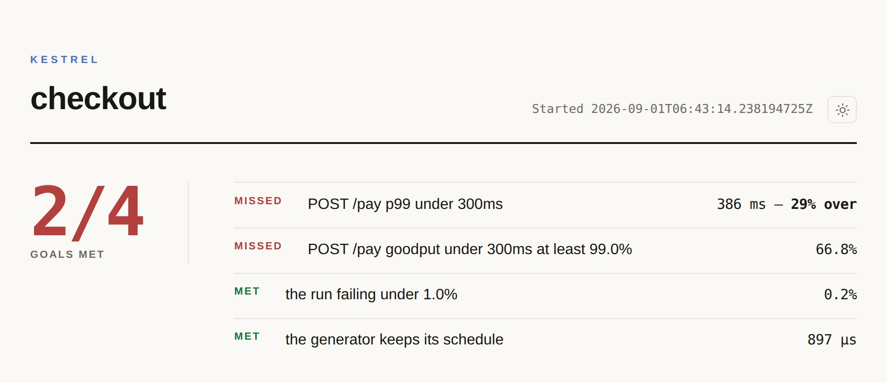
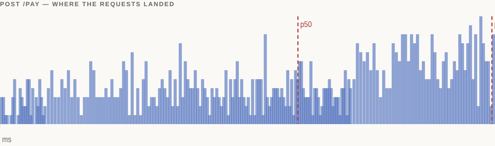

<div align="center">

<picture>
  <source media="(prefers-color-scheme: dark)" srcset="docs/assets/proofload-mark-dark.svg">
  
</picture>

# Proofload

Load testing for Kotlin.

[](https://github.com/matthewjones372/proofload/actions/workflows/build.yml)
[](https://central.sonatype.com/artifact/io.github.matthewjones372/proofload-core)
<!-- Line coverage, which is what `koverVerify`'s floor is on. It is the kinder of
     two numbers (branch coverage over the same code is materially lower) and
     0116 carries that argument.
     The number is in the URL rather than fetched from a file, because a shields
     endpoint reads that file anonymously and raw.githubusercontent.com will not
     serve one from a private repository. `coverage-badge` rewrites this line. -->
[](https://github.com/matthewjones372/proofload/actions/workflows/build.yml)
[](LICENSE)
[](https://kotlinlang.org)
[](https://adoptium.net)

</div>

When a load generator can't keep up, it queues requests and reports the wait as
the server's latency. This is known as coordinated omission. The tail latency
looks fine and the test passes even though the service is slow.

Proofload times every request from the moment it was scheduled to start, and
checks on every run whether the generator kept to its schedule. If that check
passes, the numbers describe the target rather than the tool.

<div align="center">
<a href="docs/assets/report-full-light.png">
<picture>
  <source media="(prefers-color-scheme: dark)" srcset="docs/assets/report-verdict-dark.png">
  
</picture>
</a>

<sub>A real run. <code>POST /pay</code> missed its 300 ms target. The passing
<b>"the generator keeps its schedule"</b> goal shows the miss came from the server
and not from the tool. <a href="docs/assets/report-full-light.png">The whole page</a>.</sub>
</div>

## Writing a test

A scenario is a plain Kotlin value. There is no base class to extend, no string
keys to keep in sync, and no separate DSL or Docker setup. A test runs a scenario
and asserts on the result:

```kotlin
val orderId = sessionKey<String>("orderId")
val placeOrder = step("place order")
val api = http.baseUrl("https://orders.internal")

val checkout = scenario("checkout") {
    exec(step("browse"), api.get("/products"))
    exec(
        placeOrder,
        api.post("/orders")
            .body("""{"cart":"1 anvil"}""")
            .expecting(201)
            .capture(orderId) { it.header("location") },
    )
}

class CheckoutLoadTest {

    @LoadTest
    fun `checkout holds up at fifty a second`(proofload: Proofload) {
        val result = proofload.run(checkout.at(50.perSecond, over = 1.minutes))

        assertTrue(result[placeOrder].responseTime.p99 < 200.milliseconds)
        assertEquals(0L, result.failed)
    }
}
```

`@LoadTest` passes in a `Proofload`, and the test asserts on the value `run`
returns. It runs on virtual threads using the JDK's HTTP client, so there is
nothing else to install. Keys and steps are typed and declared once: a capture
into `orderId` comes back as a `String`, and renaming `placeOrder` breaks
compilation rather than leaving an assertion on a step that no longer exists.

## Protocols

HTTP, server-sent events, WebSockets, gRPC, Kafka and JDBC come in the box, and
[Pelican](https://github.com/matthewjones372/pelican) typed endpoints are steps too.
Database steps time the connection checkout apart from the query, because a pool
your users queued for is not the database being slow.

For anything else, such as another queue or a cache, write a step body. Whatever
you call inside it is timed and recorded like any other step, so you can use the
client you already have:

```kotlin
exec(settle) {
    val outcome = ledger.settle(order)   // your own client, whatever it is
    if (!outcome.ok) fail(outcome.reason)
}
```

For work that finishes somewhere else (you publish now and match a reply that
arrives later on another channel), the measured latency is the full round trip
rather than the ack.

## Features

- **Schedule check.** Every run reports whether the generator kept its own
  schedule, so a test can't pass on a generator that fell behind.
- **Percentiles from counts.** Histogram bars are counted buckets on a log axis,
  and a percentile is the top of the bucket a sample landed in. There is no
  smoothing or interpolation.
- **HTML report.** One self-contained file with the data, styles and charts
  inline. It opens from disk, can be uploaded as a CI artifact as is, and has
  light and dark themes. [A full example.](docs/assets/report-full-light.png)
- **Inspecting a scenario before running it.** A scenario is a value, so
  `checkout.at(50.perSecond, over = 1.minutes).profile.userCount()` is `3000`
  before any request is sent.
- **Measured overhead.** The HTTP step sustains at least 2,500 requests a
  second, and a step that touches no socket sustains 100,000, on four cores
  shared with the target, over loopback, untuned.
  [docs/what-it-costs.md](docs/what-it-costs.md) has the tables, the machine and
  what each sweep left out.

The HTTP figure is a conservative lower bound. 5,000/s also kept the median
departure within a millisecond, but three requests in twenty-five thousand were
refused, so it was not used. Neither figure is a comparison with another tool,
and this repository doesn't publish any.

`fellBehind()` is not a capacity verdict. It asks whether the generator's own p99
lateness is large enough to show up next to the target's p99, which at
microsecond latencies it usually is. A `yes` at a hundred requests a second means
the target was fast, not that the tool struggled.

<div align="center">
<picture>
  <source media="(prefers-color-scheme: dark)" srcset="docs/assets/report-distribution-dark.png">
  
</picture>
</div>

## Get started

```kotlin
dependencies {
    testImplementation("io.github.matthewjones372:proofload-http:0.1.0-rc4")
    testImplementation("io.github.matthewjones372:proofload-junit5:0.1.0-rc4")
    testImplementation("io.github.matthewjones372:proofload-report-html:0.1.0-rc4")
}
```

Write the test above, then write the report:

```kotlin
result.writeHtmlReport(Path.of("build/reports/proofload/checkout.html"))
```

[The cookbook](docs/cookbook.md) covers the rest. Each recipe is a few lines,
with a note on why it is written that way rather than the obvious alternative:

| | |
|---|---|
| **[The vocabulary](docs/concepts.md)** | what a p99 is and why not an average; why lateness is a verdict; what Little's law catches |
| **Shaping load** | flat, ramped and staged profiles; Poisson arrivals; think time; a mix of journeys in one run |
| **Per-user data** | feeders as a function of the user number; CSV; a token refreshed off the measured path |
| **The requests** | captures, body checks, bodies filled per user or streamed from disk, cookies across redirects, W3C trace ids, WebSocket and SSE streams, gRPC, Kafka, work that finishes on another topic |
| **Asking the question** | goals and goodput; steady state; capacity search; comparing runs against a baseline |
| **Keeping the answer** | the HTML report, a GitHub job summary, and a baseline in CI |

> [!NOTE]
> This is early. `0.1.0-rc4` is the current release, and every coordinate on
> this page and under `docs/` is pinned to it. It is a release candidate, so the
> API may still change before `0.1.0`. `specs/` tracks what is built and what
> is not.

## Using it from an agent (MCP)

`proofload-mcp` is a stdio MCP server. Each of its tools is a call the CLI already
makes, so a model gets the same behaviour as a person at a terminal and there is
no second implementation to keep in step.

It is on Maven Central, so adding it needs no clone or build:

```bash
claude mcp add proofload -- jbang io.github.matthewjones372:proofload-mcp:0.1.0-rc4
```

The coordinate is enough because the published jar has a `Main-Class`.
[Coursier](https://get-coursier.io) works too, with `cs launch`. `java -jar` does
not work: the jar is thin and has no classpath, so whatever starts it has to
resolve the POM.

Two other routes need no launcher. One is a download from the GitHub release,
which includes a `.bat` and so also works on Windows. The other is a container:

```bash
claude mcp add proofload -- docker run -i --rm -v "$PWD:/work:ro" ghcr.io/matthewjones372/proofload-mcp:0.1.0-rc4
```

With that command, `benchmark`, `plan_schema`, `validate`, `preview`, `smoke` and
`trace` work with no other setup. Only `run` needs a fence: write a
`proofload.toml` in the directory you started it from and it is picked up, since
that directory is what the mount passes in.

Mount the directory rather than the file. `-v "$PWD/proofload.toml:..."` looks
tidier, but if the file doesn't exist yet Docker creates a directory called
`proofload.toml` in your working directory, which then can't be read as an
allowance. Mounting the directory avoids this.

[docs/mcp.md](docs/mcp.md#starting-it) has all four routes.

Maven Central and the release download need no account. The GHCR image does: its
package is still private, so `docker` needs `docker login ghcr.io` until that
changes.

To work on Proofload itself, or to try an unreleased change, build it instead:

```bash
./gradlew :proofload-mcp:installDist
claude mcp add proofload -- "$PWD/proofload-mcp/build/install/proofload-mcp/bin/proofload-mcp"
```

A base URL is enough to start. `benchmark` writes a plan, validates it, previews
what it would send, sends one request per step, and then lists what it had to
guess:

```
> Does checkout hold up?  https://orders.internal

proofload:  plan/1
baseUrl:  https://orders.internal
scenario: smoke
steps:
  - name: root
    get: /
load:
  rate: 1/s
  over: 10s

Running this would send 10 requests over 10s peaking at 1.0/s to orders.internal.
One request per step, already sent: 1 requests, 1 ok, 0 failed

Nothing above sent load. Call `run` with this plan to do that.

This plan is guessing. Ask whoever wants the benchmark:
  - This only sends `GET /`, because a base URL is all it was given. Which paths
    actually matter: a journey, a hot endpoint, a slow one?
  - The rate is a placeholder, one a second, because nothing said otherwise.
    What does this see at peak, and over how long?
```

The questions come from that plan and that smoke test. For example, it asks about
a credential only if the target answered 401. Once you answer, it sets the rate
and calls `run`. `run` returns straight away instead of blocking for the length
of the test, so you poll it:

```json
{"runId":"r-3f9c1a04","sending":"3000 requests over 1m to orders.internal"}
{"state":"sending","remaining":"41s"}
```

When it lands, `status` is the same document the HTML report is drawn from:
every goal `met` or not, with the `remedy` beside the one that missed.

`status` is meant for a model. `summary` is meant for you, in the chat: the
markdown a GitHub job summary carries (the step table, the behind verdict,
failures and totals), followed by the distribution the percentiles were read
from, which the numbers alone don't show:

```
checkout  p50 10.0ms  p99 2.00s
 10ms  ############  900
100ms
   1s  #  100
```

Nine in ten requests answered in 10 ms and the rest took two seconds. A p99 of
2 s on its own looks like a uniformly slow step, but here it is a cache missing a
tenth of the time. The bars are the counted buckets on the same log axis as the
HTML report, with the count printed beside each one, and a decade with no
samples is left blank.

**OpenAPI.** If the service has an OpenAPI document, `from_openapi` reads it
(YAML or JSON) and writes the plan it describes, so the paths, methods and step
names come from the contract. `baseUrl` is only needed when the document names
no server.

It also reads the range of each parameter. Repeating one id only measures one
row and one cache line, and cardinality and skew affect the p99. `minimum: 1, maximum: 500` becomes a uniform draw over exactly that
range, and `enum: [emea, apac, amer]` becomes every value it lists rather than
the first one, so the plan it writes arrives with its draws already in it:

```yaml
draw:
  sku:    {uniform: {from: 1, to: 500}}
  region: {oneOf: [emea, apac, amer]}
steps:
  - name: getProduct
    get: '/products/{sku}'
  - name: getRegion
    get: '/regions/{region}'
```

The braces survive so the draw has something to fill: `{sku}` in a path or a body
is filled per user from the session key of that name. A parameter the contract
does not bound is substituted rather than drawn, so the plan doesn't invent a
cardinality the contract never stated.

`draw` can be written in any plan, not only generated ones. The generators are
`uniform`, `zipf`, `oneOf`, `digits` and `uuids`. `zipf` matches the shape of
much real traffic, with a few keys requested constantly and a long tail
requested once:

```yaml
draw:
  sku: {zipf: {keys: 1000000, skew: 1.1}}
```

**Only `run` sends load.** The other tools send nothing, or one request per
step, and [the table](docs/mcp.md#the-tools) says which. A model still working
out a plan can't accidentally send three thousand requests a second.
`proofload.toml` limits what `run` may do by host, rate, duration and request
count.

**[docs/mcp.md](docs/mcp.md)** is the reference: every tool, what it sends, what
it refuses, and the `plan/1` format a model can ask for instead of guessing.

## Further reading

- **[docs/what-it-costs.md](docs/what-it-costs.md)**: the tool's own measured overhead.
- **[docs/invariants.md](docs/invariants.md)**: the sixteen statements a correct measurement depends on, and the five that do not hold yet.
- **[docs/modules.md](docs/modules.md)**: the modules and the coordinates to depend on them.
- **[docs/mcp.md](docs/mcp.md)**: the MCP server in full: every tool, what each one sends, and what it refuses.
- **[docs/allowance.md](docs/allowance.md)**: `proofload.toml`, the fence a run is held to, and why it is a fence rather than a sandbox.
- **[docs/exporting.md](docs/exporting.md)**: a run's measurements in the formats other tools read.
- **[docs/more-than-one-injector.md](docs/more-than-one-injector.md)**: one run sent from several machines, and read back as the run they were pieces of.
- **[docs/for-agents.md](docs/for-agents.md)**: every public signature, rendered from the `.api` dumps, for handing to a model.
- **[docs/from-java.md](docs/from-java.md)**: writing a load test in Java, and why the facade is a module rather than annotations on core.
- **[docs/from-scala.md](docs/from-scala.md)**: the same from Scala 3, over the Java facade, with `FiniteDuration` both ways, and a load test that is a zio-test test.
- **[AGENTS.md](AGENTS.md)**: read this first if you want to work on Proofload itself.

```bash
./gradlew build          # tests, detekt, spotless, coverage
```

`proofload-core` depends on the Kotlin standard library and nothing else, and a
test enforces it. Each module asserts its own runtime classpath, so core can't
gain a dependency and the Kotest module can't start depending on the JUnit one.

## License

Apache 2.0. See [LICENSE](LICENSE).
